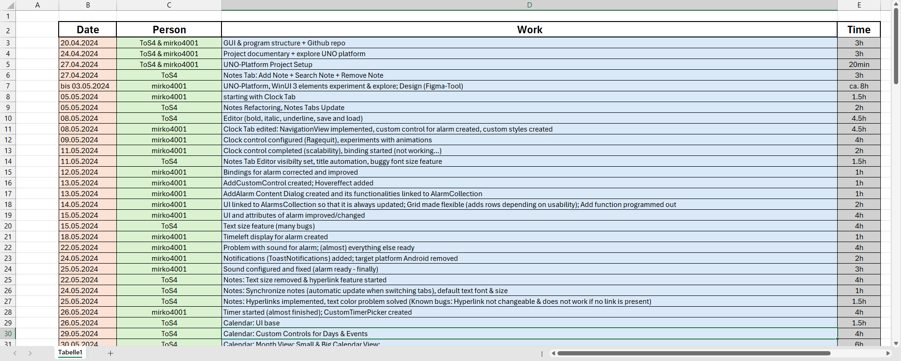
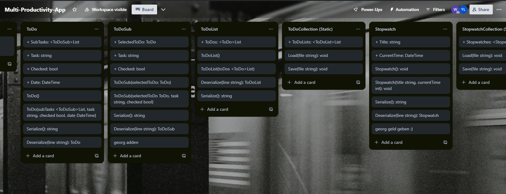
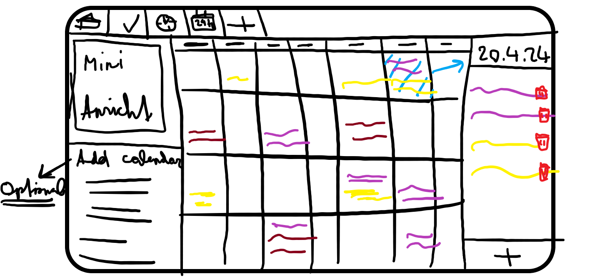
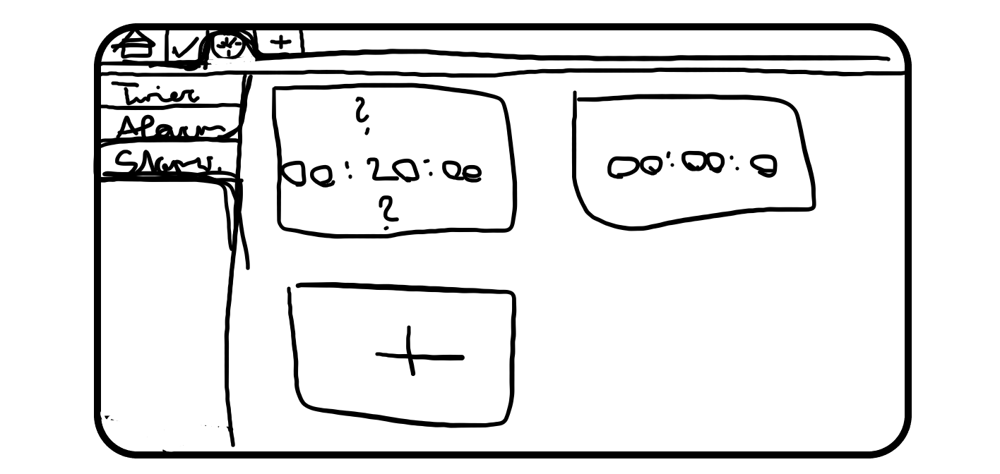
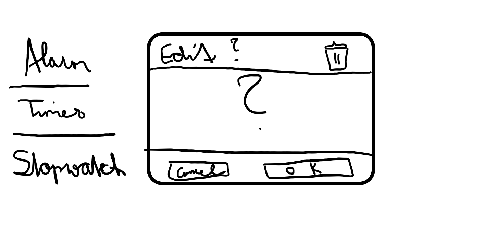
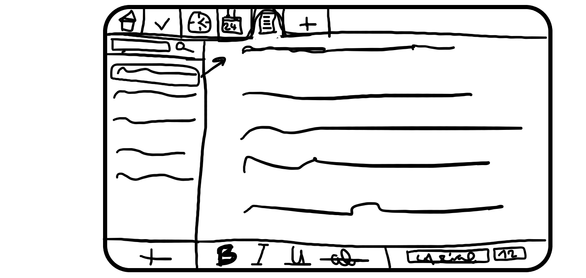
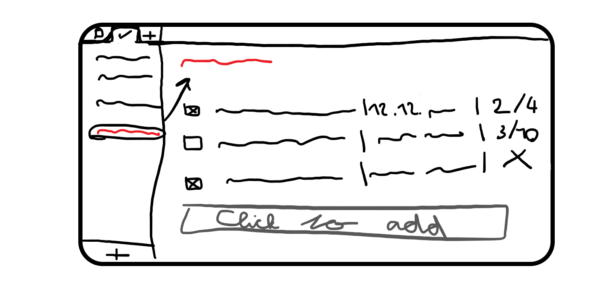
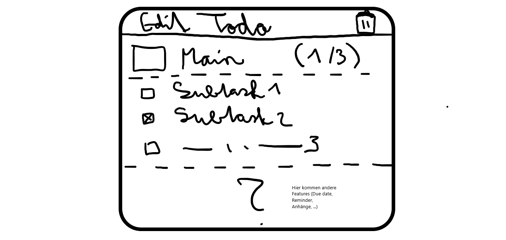
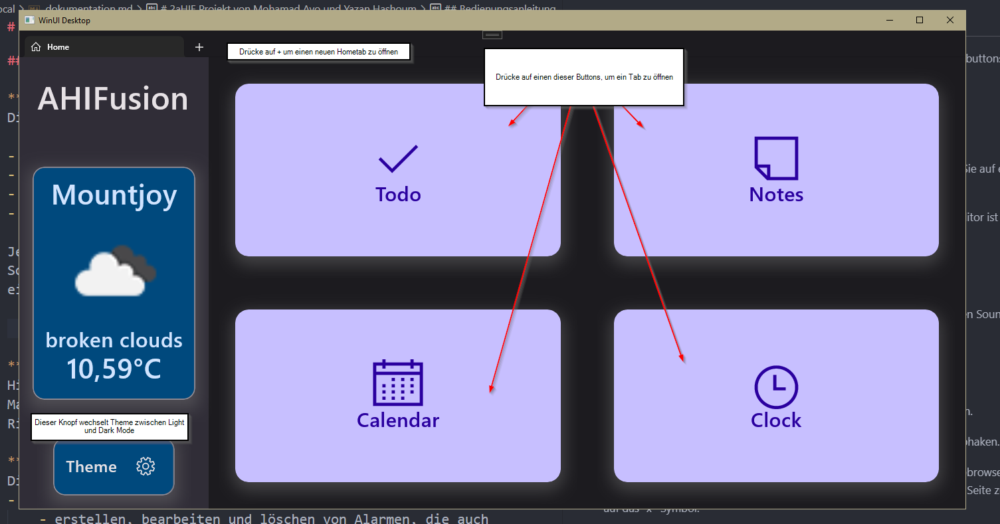

# 2aHIF Projekt von ToS4 und mirko4001

## [Projekttagebuch](https://htlr-my.sharepoint.com/:x:/g/personal/yazan_hashoum_student_htl-rankweil_at/Ec3GX-KeYRFEpIfqBQQXTRUB8d9-cOnUdau6AOi-lI_6Wg?e=Y7Fuf8)

## [Projektplanung](https://trello.com/invite/b/LJnpdwUM/ATTI610be768a983ae631da54edee9e85e7538E5F07C/multi-productivity-app)

Die Klassen haben wir in Trello erstellt (für leichteres Management) 

### Must-Haves
- Uno-Plattform
- Kalender
    - Erstellung und Verwaltung von Ereignissen
    - Rasteransicht
    - Monatsansicht
- To-Do
    - Unterstützung für mehrere Aufgabenlisten
    - Möglichkeit zur Erstellung von Unteraufgaben
    - Bearbeitungsfunktion
    - Verfolgung des Aufgabenabschlusses
- Notizen
    - Unterstützung für mehrere Seiten
    - Grundlegende Textformatierung (Fett, Kursiv)
- Uhr
    - Weckerfunktion
    - Timer
    - Stoppuhr
- Navigations-Tabs (Startseite, Uhr, etc.)
- Datenpersistenz
    - Speichern und Laden von Daten im JSON-Format
- Protokollierung mit Serilog

###  Nice-To-Haves
- Möglichkeit, Notizen als PDFs zu exportieren
- Erinnerungen und Benachrichtigungen
- Datenbankintegration
- WebAPI-Integration (Wetter, Google Kalender, etc.)
- Einstellungen
    - Dunkler und heller Modus
    - Lautstärkeregelung
    - Möglichkeit zur Konfiguration von Sounds und SFX
- Kalender
    - Unterstützung für mehrere Ansichten (Tag, Woche, Jahr)
- Notizen
    - Erweiterte Textformatierung (Markdown-Editor)
- Aufgabenliste
    - Möglichkeit, Dateien an Aufgaben anzuhängen
- Tags oder Etiketten zur Organisation von Aufgaben und Notizen

### Don't-Haves
- KI-Assistent
- Unbegrenzter Datenspeicher
- Mobile App-Unterstützung (iOS und Android)
- Web-Unterstützung

### Fotos der ursprünglichen Designs

Homepage

Kalenderpage

Clockpage

Edit Fenster Clock

Notespage

Todopage

Edit Fenster Todo

## Umsetzungsdetails
**Umsetzung**
Aufgaben wurden aufgeteilt und wir haben angefangen, keep it simple.

Yazan: zuständig für Clock und Todo Features, auch für UI Design (Frontend)

Mohamad: zuständig für Kalender und Notes Feature, auch für weitere Features (Backend)

Wir haben in den ersten 2 Wochen fast nichts für das Projekt gemacht, da wir eine neue Umgebung - Uno Platform - kennengelernt haben. Erstmals brauchte es sehr lange, ein fehlerfreies Programm zu ERSTELLEN. Danach haben wir uns beide lange damit beschäftigt, die Features von Uno zu testen.

**Softwarevoraussetzungen**
Funktioniert gut auf Windows 10 & 11.
GPS & Internet wird für WetterAPI benötigt

in den Einstellungen müssen Notifikations- und Lokationsrechte erteilt werden, damit alles funktioniert

**Verwendete Technologien**
- [Visual Studio 2022](https://visualstudio.microsoft.com/vs/)
- [Visual Studio Code](https://code.visualstudio.com/)
- Internet
    - [UNO-Plattform Dokumentation](https://platform.uno/docs/articles/intro.html)
    - [Google](https://www.google.at/)
    - [ChatGPT](https://chatgpt.com/)
    - [GitHub Copilot](https://github.com/features/copilot)

**Probleme & Lösungen**
- Problem: Stopuhr wird nicht gespeichert
- Lösung: Mehr zeit -> wir finden es raus -> ez fix

- Problem: Timer Progressring setzt sich zurück beim Navigieren in der ClockPage
- Lösung: das Initialisieren vom Timer überarbeiten

- Problem: Shadowcontainer funktionieren nicht immer (Bug?)
- Lösung: Keine Gefunden

- Problem: Wenn wir die Unpackaged Version der App nehmen, dann kann man keine Sounds hören. Wenn wir die Packaged Version nehmen, dann kann man nicht serialisieren ;(
- Lösung: nicht mehr Uno Platform verwenden

## Bedienungsanleitung

**Startseite (Home Tab)**
Die Startseite der Software besteht aus vier Hauptbuttons:

- Notes
- Clock
- Calendar
- To Do

Jeder dieser Buttons repräsentiert eine Funktion unserer Software. Wenn Sie auf einen dieser Buttons klicken, wird eine neue Seite erstellt und die Startseite wird gelöscht.

**Notes**
Hier können Sie Notizen erstellen und speichern. Ein Markdown-Editor ist auch verfügbar. Es wird ein Rich-Text-Editor verwendet

**Clock**
Dieser Tab hat 3 Features:
- Alarm
    - erstellen, bearbeiten und löschen von Alarmen, die auch einen Sound abspielen und Notifications senden
- Stopwatch
- Timer
    - mit einem progressring

**Calendar**
Hier können Sie Termine eintragen und Ihren Kalender verwalten.

**To Do**
In diesem Bereich können Sie Aufgaben erstellen, verwalten und abhaken.

**Tabs**
Die Tabs in unserer Software funktionieren ähnlich wie in einem Webbrowser. Sie können jederzeit neue Startseiten erstellen, indem Sie auf das "+"-Symbol klicken. Um eine Seite zu schließen, klicken Sie auf das "x"-Symbol.